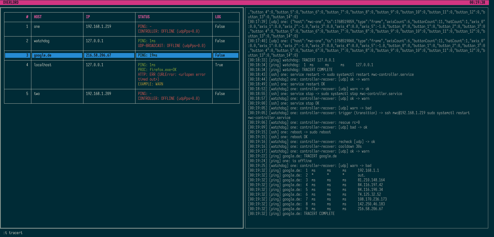

# Overlord




Overlord is a lightweight, terminal-based monitoring and control tool for temporary and on-site deployments. It provides a fast Rich-based TUI that shows live host and service status, focused on immediate visibility and manual control rather than long-term monitoring.

Overlord uses a plugin-based architecture: plugins are configured per host via TOML, run independently, report status to the UI, and may expose interactive commands. 

~~Overlord currently supports Windows only due to its use of msvcrt for keyboard handling.~~
Overlord supports Windows and Linux input, but plugins are not yet Linux-ready.


## Install

- Clone the repository
- run `install.cmd`


## Requirements:

```
python_version >= "3.11"
rich>=13.7.0
tomli
```

---

## Host Configuration (TOML)

Each TOML file defines **exactly one host**.

### Top-level keys

| Key              | Description |
|------------------|-------------|
| `name`           | Logical host name shown in UI |
| `host`           | Primary hostname or IP |
| `order`          | Sorting priority in host list (lower = higher) |
| `enabled`        | Optional, disable entire host |

### Plugin sections

- Each section name corresponds to a plugin type
- Parameters override plugin defaults
- Defaults and overrides are **deep-merged**
- Multiple plugins per host are allowed

---

### Minimal example

```toml

name = "controller-01"
host = "192.168.1.50"

[ping]
```

### Full example

```toml
name = "controller-01"
host = "192.168.1.50"
order = 10

[ping]
everySec = 2.0
timeoutMs = 1500

[udp]
port = 5000
serviceName = "UDP-BROADCASTER"

[http]
url = "/health"
forceHttps = true
everySec = 5

[processes]
port = 8765
prog = ["controller.exe", "watchdog.exe"]

[ssh]
user = "root"

[[ssh.commands]]
key = "r"
label = "reboot"
command = "sudo reboot"

[[ssh.commands]]
key = "s"
label = "restart service"
command = "systemctl restart controller.service"
```

---

## Plugins

Overlord plugins are simple, self-contained Python modules placed in the `plugins/` directory.  
Each plugin implements one feature (monitoring or action) and is loaded automatically at startup.

A plugin:
- Has a **type name** (used in TOML config)
- Receives its configuration via `params`
- Emits status via `TableRow`
- Optionally exposes commands
- Runs independently of other plugins


### Minimal Plugin Structure

A plugin file must define:
- `typeName`
- `pluginMeta` 
- `createPlugin(core, hostKey, params)`


---

### Minimal Example Plugin

```python
# plugins/example.py

from __future__ import annotations
import time
import threading
import random
from typing import Any

from lib.core import MonitorCore
from lib.pluginApi import PluginMeta, TableRow
from lib.pluginBase import PluginBase

typeName = "example"

pluginMeta = PluginMeta(
    typeName="example",
    defaultParams={
        "everySec": 3.0,
    },
    exposeStatus=True,
    showInTable=True,
)


class ExamplePlugin(PluginBase):
    typeName = "example"

    def __init__(self, core: MonitorCore, *, hostKey: str, params: dict[str, Any]) -> None:
        super().__init__(core, hostKey=hostKey, params=params)
        self.everySec = float(params.get("everySec", 3.0))
        self.stopEvent: threading.Event | None = None

    def start(self) -> None:
        self.stopEvent = threading.Event()
        threading.Thread(target=self.loop, daemon=True).start()

    def stop(self) -> None:
        if self.stopEvent:
            self.stopEvent.set()

    def loop(self) -> None:
        states = [
            ("ok", "EXAMPLE: OK"),
            ("warn", "EXAMPLE: WARN"),
            ("bad", "EXAMPLE: FAIL"),
        ]

        while self.stopEvent and not self.stopEvent.is_set():
            sev, text = random.choice(states)

            self.writeTable(
                TableRow(
                    host=self.hostKey,
                    source="example",
                    text=text,
                    severity=sev,
                    ts=time.time(),
                )
            )

            time.sleep(self.everySec)


def createPlugin(core: MonitorCore, hostKey: str, params: dict[str, Any]) -> ExamplePlugin:
    return ExamplePlugin(core, hostKey=hostKey, params=params)
```
